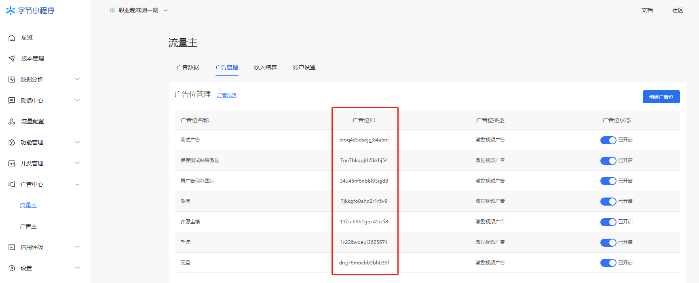

##广告组件使用手册
源代码目录：d-name/common/AD.js
使用方式。
1.在当前页面通过import `<script>` 方式引入 AD.js
``` javascript
    import {
        mapMutations,
        mapState
    } from 'vuex';
    import video from '@/common/AD.js';
    .....
```
2.准备好对应小程序的auid，和对应产品的dictKey
auid获取方式可以登录抖音小程序开发者平台，在流量主页面进行查找。广告中心=>流量主=>广告管理=>广告位ID。

<br>
dictKey可以找产品索要。dictKey 通过在新增编译模式，在新增编译模式的配置页面新增参数`dictKey=xxx`进行使用。
目的是获取对应的产品信息。App.vue 页面会自动将dictKey对应的产品信息在`onlaunch`的时候获取到全局状态变量`goodsMode`内。
如需在页面使用直接使用`vuex`的 `mapState`或者自己手写计算属性。

3.引入计算属性
```javascript
export default {
        computed: {
            ...mapState(['goodsMode', 'showvideoAd', 'setting', 'seeAdType'])
        }
}
```
- `goodsMode` 是产品信息
- `showvideoAd`当前用户是否能正常播放广告
>tip:抖音激励视频广告组件只有在抖音app在有，在今日头条，今日头条极速都没有。在小程序启动的时候会做检测，判断当前用户是否是在抖音app环境中，如果是
>`true`则需要调用广告组件（AD.js）如果是false则直接进入结果页面。
- `setting` 省略
- `seeAdType` 省略

4.使用方式 
```html
 <dio-adpopup num="364857" homePage="/pages/more/more" @seeAd="playvideoAd()" ref="adpopup"></dio-adpopup>
```
```javascript
export default {
    methods:{
      playvideoAd(){
           if (!this.showvideoAd) {
                this.jumpresult();
                return;
            }
          video.ViodeAd.goodsId = this.goodsMode.goodsId;
          new video.ViodeAd(self.jumpresult, '5r6q4d5dsojgj84a6m', self.seeAdFail);
      },
      jumpresult(finsh) {
          //finsh 是true 则表示用户看完广告，为false 则表示广告加载错误，或者用户主动关闭广告
          //跳转对应的结果页面，请注意这里使用的redirectTo 具体使用的跳转方式应根据自身业务做判断
          uni.redirectTo({
              url: '../choiceResult/choiceResult'
          });
      },     
    }
 }
```
